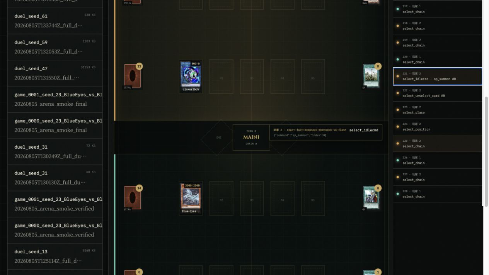
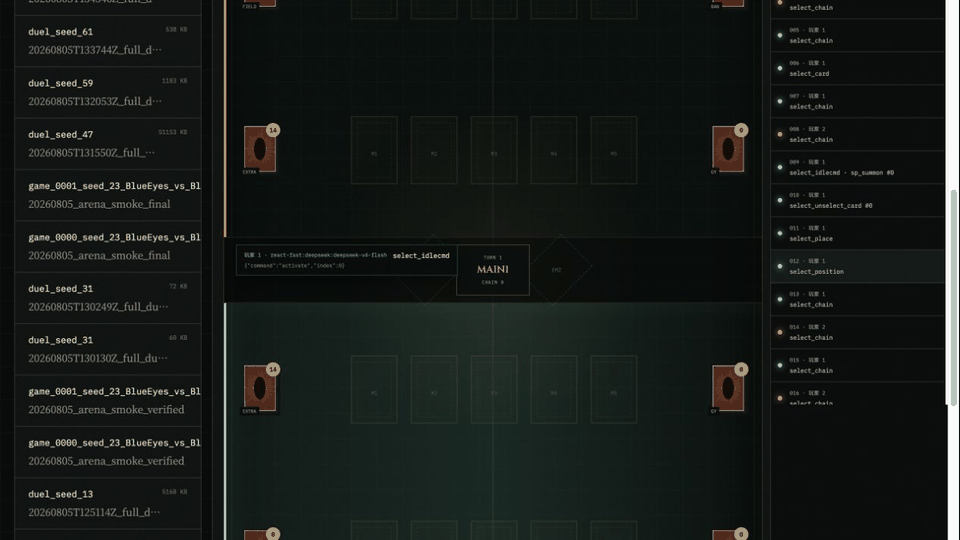
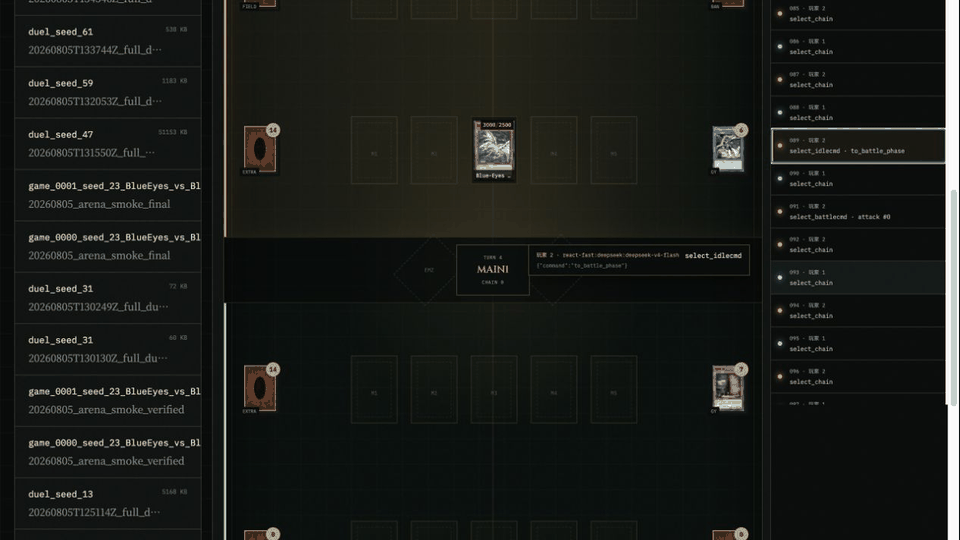
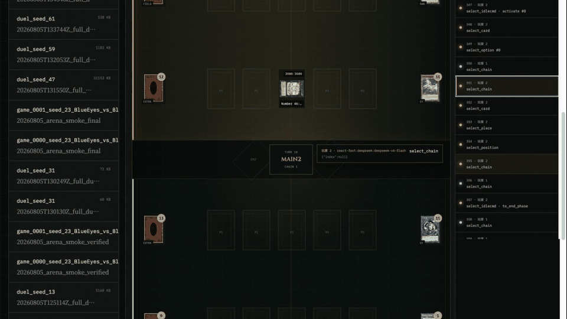
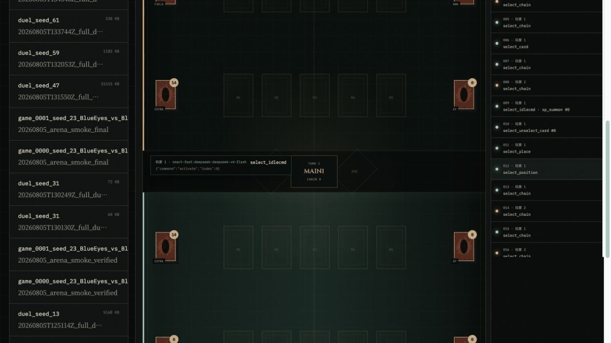

# YGO-Bench

English documentation · [Chinese README](README.zh-CN.md)

YGO-Bench is a reproducible benchmark for LLM agents playing Yu-Gi-Oh!. It
combines the PTCG-Bench-style agent/evaluation layers with the real EDOPro
`ocgcore` rules engine, CardScripts, BabelCDB, deterministic decks, and a
frame-by-frame visual replay UI.

It supports puzzle solving, full-duel tool use, N-attempt plans,
passive/random/ReAct agents, round-robin Arena matches, token and latency
metrics, illegal-action tracking, and hidden-information filtering. Player 1
is always rendered at the bottom of the replay board and Player 2 at the top.

## Quick start

```bash
uv sync --extra dev
uv run ygo-bench setup
uv run ygo-bench doctor

# terminal 1
uv run ygo-bench-api

# terminal 2
cd frontend && npm install && npm run dev
```

Open `http://localhost:5173/?view=replays` to inspect LP, hands, field zones,
graveyards, chains, phases, agent actions, and card details. See
[`docs/BENCHMARK_PROTOCOL.md`](docs/BENCHMARK_PROTOCOL.md) for the protocol and
the command reference below.

## Replay Gallery

The gallery below comes from a complete **BlueEyes vs BlueEyes** dual-LLM duel
(seed `79`). Player 1 is at the bottom, Player 2 is at the top, and the action
ledger can jump to `select_*`, `sp_summon`, and `set_spell` decisions.



| Opening | Mid-game |
| --- | --- |
|  |  |

| Endgame | Overview |
| --- | --- |
|  |  |

## Architecture

```text
LLM / rule / RL agent
          |
          v
ygobench agent protocol
          |
          v
puzzle suite -------- full-duel / arena suite
          |
          v
yugi-bench harness -> libocgcore -> CardScripts + BabelCDB
          |
          v
JSONL replay, metrics.json, leaderboard-ready outcomes
```

EDOPro itself is a GUI client. This project uses only the rules-core ecosystem:
`ygopro-core`, CardScripts, and BabelCDB. `vendor/yugi-bench` is pinned as an
Apache-2.0 engine adapter and puzzle-validation base.

## Installation

```bash
uv sync --extra dev

# Fetch pinned ocgcore / CardScripts / BabelCDB / Puzzles and validate offline
uv run ygo-bench setup

# Check local dependencies and engine state
uv run ygo-bench doctor
```

On macOS, `setup` requires Xcode Command Line Tools, `make`, and `premake5`.
If `premake5` is unavailable, YGO-Bench downloads the pinned version into
`.tools/` without modifying the system installation.

## Web Lab

Start FastAPI:

```bash
uv run ygo-bench-api
```

In another terminal, start React/Vite:

```bash
cd frontend
npm install
npm run dev
```

Open `http://localhost:5173`. The lab provides:

- engine, dataset, and run status overview;
- eight preset `.ydk` decks synchronized from `ygo-agent`;
- local BabelCDB metadata and on-demand card-art caching;
- a run archive and table-level replay for LP, hands/decks, field zones,
  graveyards, phases, chains, agent tool calls, and outcomes.

The replay UI uses user-facing seats: **Player 1 is always at the bottom
(teal)** and **Player 2 at the top (amber)**. JSONL and ocgcore continue to use
internal seats `0/1`. Both agents and decks are shown; `passive` runs are
marked as rule-validation baselines rather than active strategies.

Resync the preset decks with:

```bash
uv run python scripts/sync_decks.py
```

Replay frames come from real ocgcore observations in JSONL; the frontend does
not simulate or fabricate card states.

### Replay details

The assets come from a complete **BlueEyes vs BlueEyes** dual-LLM duel (seed
`79`). Player 1 is rendered at the bottom and Player 2 at the top. The action
ledger can jump to any `select_*`, `sp_summon`, or `set_spell` decision, and
field cards open a detail view.

This replay lasts 12 turns and 445 decisions. Player 2 wins with LP `0 - 8000`;
both players have zero illegal actions and protocol fallbacks. The raw JSONL is
written to local `bench_data/runs/`, which is ignored by Git. Only lightweight
showcase assets are committed, so run logs and API credentials are not uploaded.

## Evaluation

Copy `.env.example` to `.env` and fill in the model API key. `.env` is ignored
and must never be committed.

Interactive per-decision evaluation:

```bash
uv run ygo-bench eval \
  --provider deepseek \
  --model deepseek-v4-flash \
  --limit 5 \
  --concurrency 1
```

N-attempt plan evaluation:

```bash
uv run ygo-bench eval \
  --provider openai \
  --model gpt-5 \
  --attempts 3 \
  --limit 20
```

Preview the command without running it:

```bash
uv run ygo-bench eval --provider deepseek --model deepseek-v4-flash --limit 1 --dry-run
```

Results are written to `bench_data/runs/<run-name>/`:

- one JSONL per task with observations, tool calls, and engine results;
- `_summary.json` with upstream per-task results;
- `metrics.json` with normalized YGO-Bench metrics.

Run a complete headless duel benchmark:

```bash
uv run ygo-bench duel \
  --deck1 BlueEyes \
  --deck2 CyberDragon \
  --agent1 react \
  --agent2 passive \
  --seed 11
```

Run two LLM agents without a decision cap:

```bash
uv run ygo-bench duel \
  --deck1 BlueEyes \
  --deck2 CyberDragon \
  --agent1 react \
  --agent2 react \
  --seed 59 \
  --max-decisions 0
```

When a pending decision has exactly one legal response, the protocol submits it
without a model call. Every decision with a real choice is still made by the
corresponding player's LLM.

For a full run with lower long-thinking latency, use `react-fast` for both
players. It uses the same LLM and full observations while disabling extra
provider thinking; the replay records `thinking_enabled` and model parameters,
so it should not be mixed with high-reasoning leaderboard results.

The full-duel profile allows up to 32,768 output tokens per call, eight card
lookups per step, and two tool-only correction retries. `--max-decisions 0`
means there is no total decision cap.

The command creates a standard MR5 duel with 8000 LP, five opening cards, and
one draw per turn through ocgcore, then emits per-decision JSONL. `passive` is a
deterministic conservative baseline, `random` samples from a bounded legal
action space, and `react` uses the provider/model in `.env`. You can also use
`react:deepseek:deepseek-v4-flash` explicitly.

Run a side-swapped round-robin Arena:

```bash
uv run ygo-bench arena \
  --agents passive random react:deepseek:deepseek-v4-flash \
  --decks BlueEyes CyberDragon \
  --seeds 11 29
```

Each agent/deck/seed combination swaps the first player. Output includes wins,
illegal-action rate, decision latency, tokens, Elo, Glicko-2, first-player
breakdowns, and a deck matchup matrix. See
[`docs/BENCHMARK_PROTOCOL.md`](docs/BENCHMARK_PROTOCOL.md).

Re-aggregate an existing run:

```bash
uv run ygo-bench report bench_data/runs/<run-name>/_summary.json
```

## Metrics

The primary puzzle metric is `solve_rate`. We also record:

- `engine_completion_rate`: the share of runs reaching a normal engine end;
- `avg_tool_calls` and `avg_model_calls`;
- `input_tokens` and `output_tokens`;
- `avg_elapsed_seconds`;
- failure counts by termination type.

Full duels use swap-side win rate, illegal-action rate, mean decision latency,
Glicko-2/Elo, and a deck matchup matrix. Do not place scores from different
card pools, banlists, rules-core commits, or observation permissions on the
same leaderboard.

Full-duel prompts live in `ygobench/agents/prompts/`. Each decision provides
only the current player's view and exposes only the current responder schema
and `inspect_card`. The system requires exactly one response tool call; tool
indices are valid only for the current observation.

## Development

```bash
uv run pytest
uv run ruff check .
```

See `NOTICE` for third-party licenses and trademark notices. When publishing
research results, record this repository commit, submodule commits,
ocgcore/CardScripts/BabelCDB commits, dataset versions, and run configuration.

## Resources

- Rules core: [edo9300/ygopro-core](https://github.com/edo9300/ygopro-core)
- Card scripts: [ProjectIgnis/CardScripts](https://github.com/ProjectIgnis/CardScripts)
- Card database: [ProjectIgnis/BabelCDB](https://github.com/ProjectIgnis/BabelCDB)
- Puzzle and validation base: [yugi-bench-v1](https://github.com/yugi-bench/yugi-bench-v1)
- Preset decks: [sbl1996/ygo-agent](https://github.com/sbl1996/ygo-agent)
- Banlists: [ProjectIgnis/LFLists](https://github.com/ProjectIgnis/LFLists)

Card art is cached on demand by the backend from the YGOPRODeck image service;
the repository does not bulk-commit card images.
